# Errors

- Compiler errors
  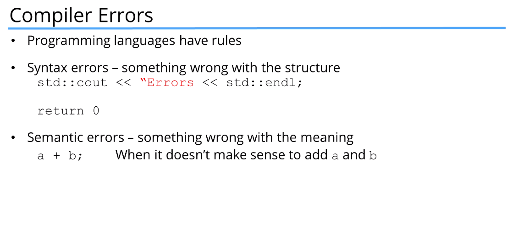
- Compiler warnings
  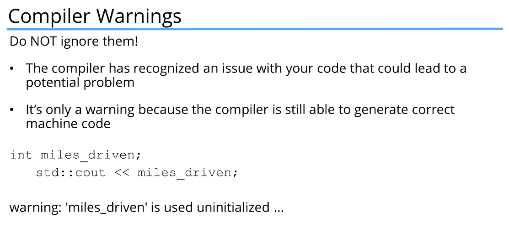
  Also initialized the variable but not used in the program
- Linker errors
  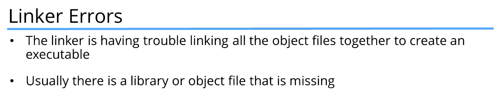
  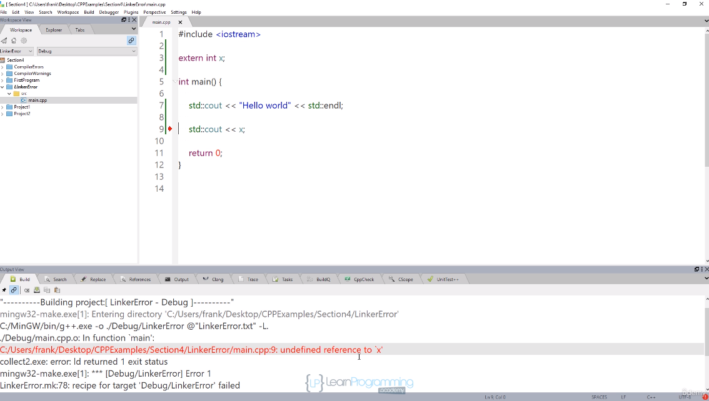
- Runtime errors
  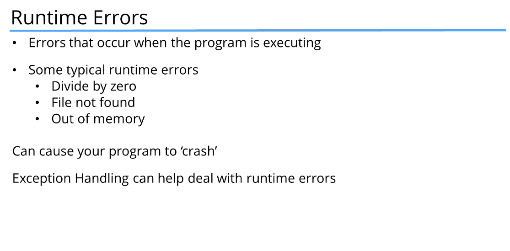
- Logic errors
  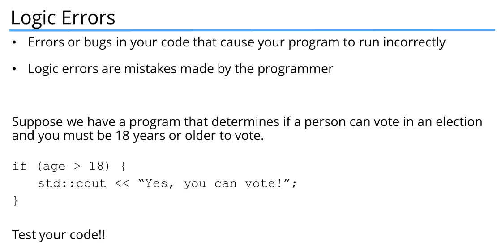

# C++  keywords
 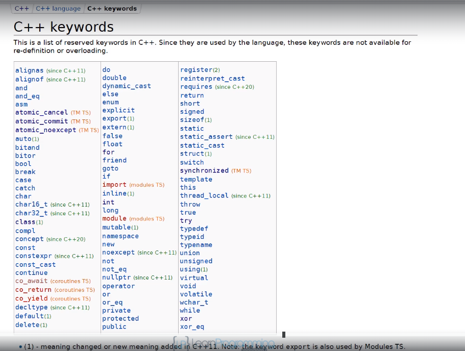

`<<` -> stream insertion operator
`>>` -> stream extraction operator
`::` -> scope resolution operator

# Preprocessor directives 
`# incude` is a preprocessor directive
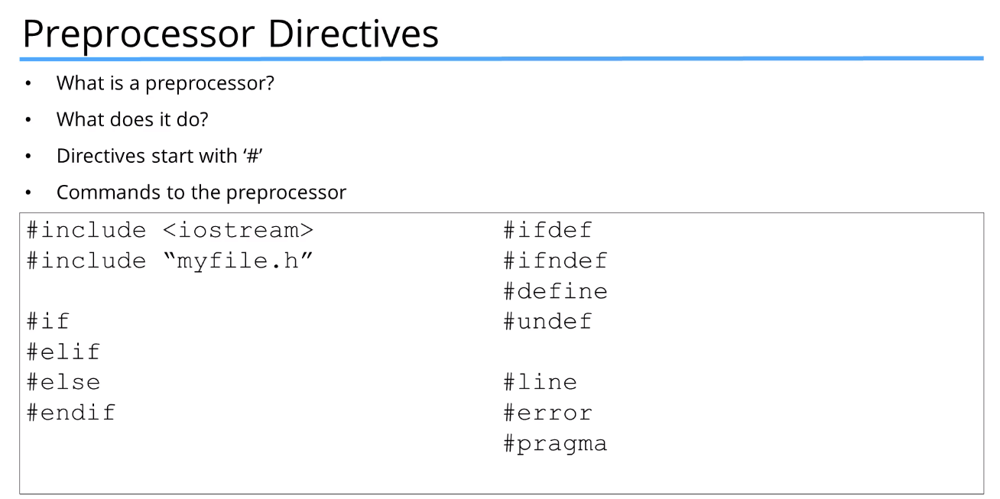

# Comments in cpp
- `//` single line comment in c++
- `/* */` everything between this is a comment. It is a multiline comment

  # Main function
  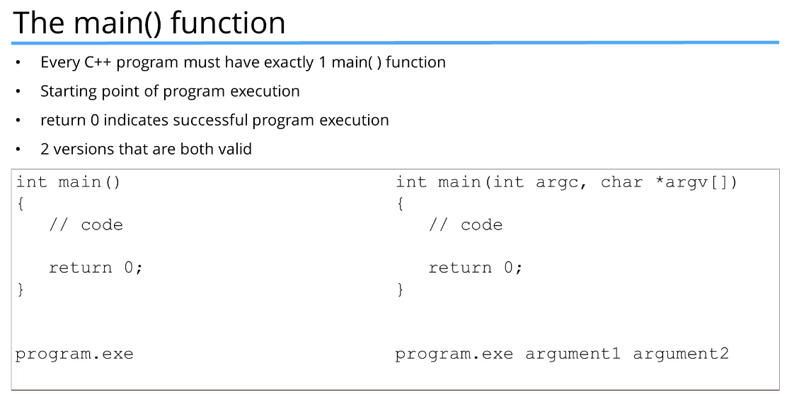

  # Namespaces
  `using namespace std;`
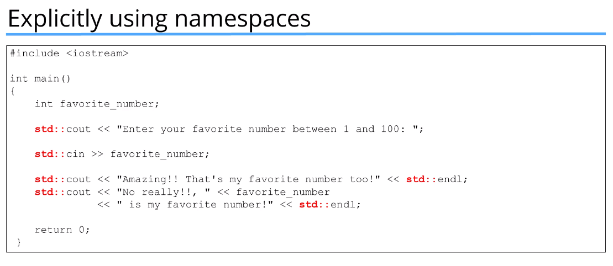
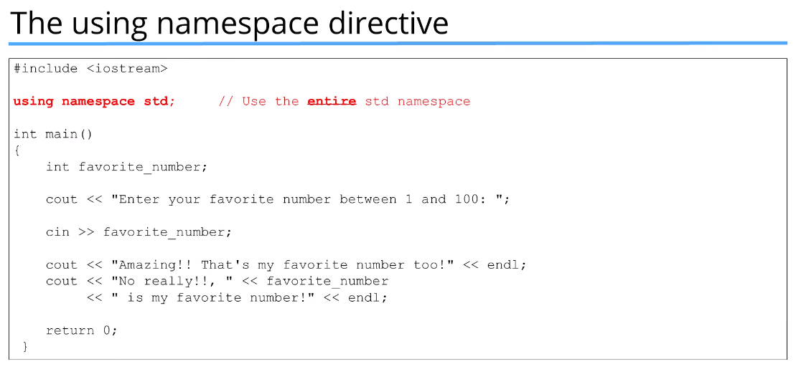

Try not to use in large programs as multiple variables with the same name will be present in your code as well as other codes and libraries. You can do this instead
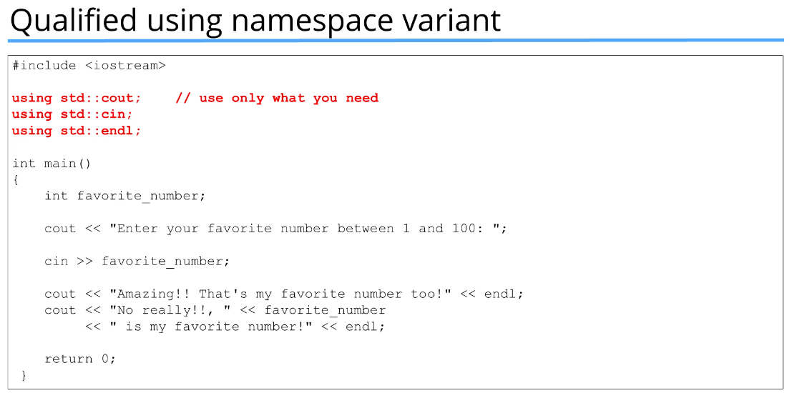

# Input/ Output operators
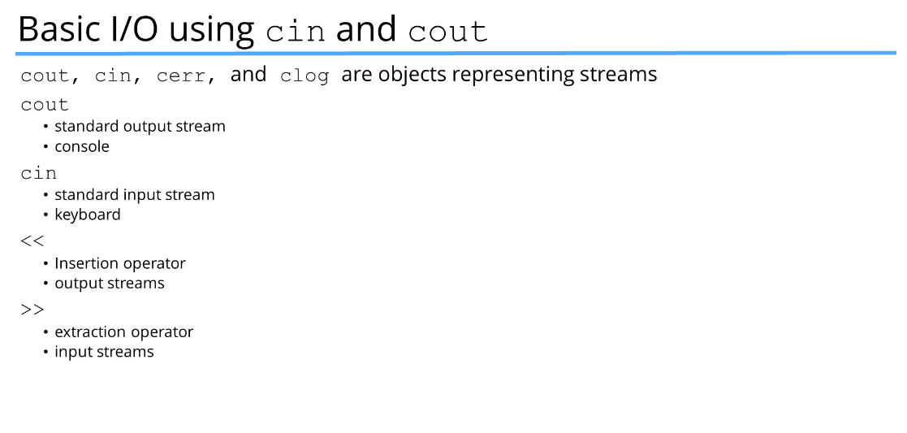

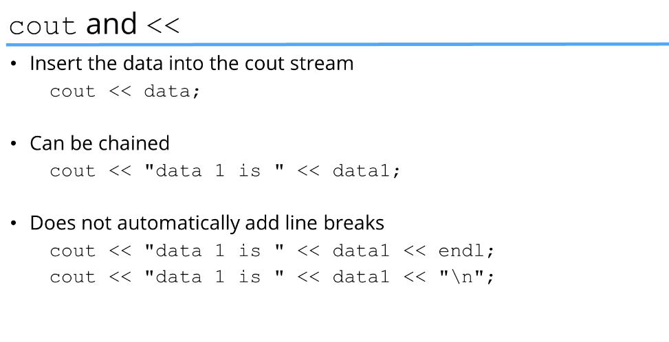

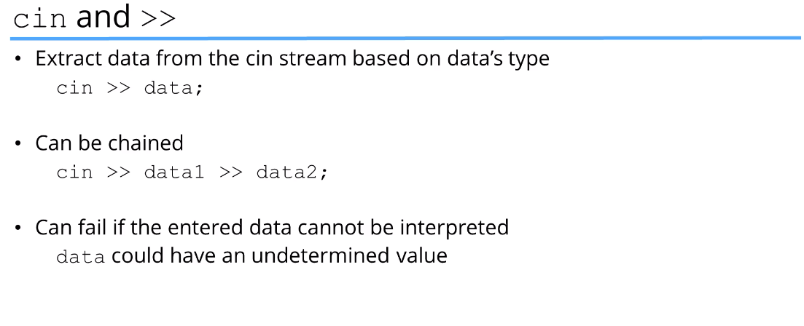
  
