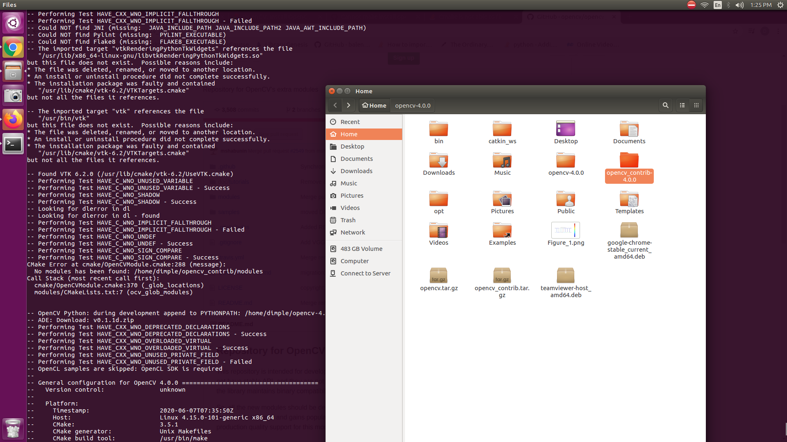
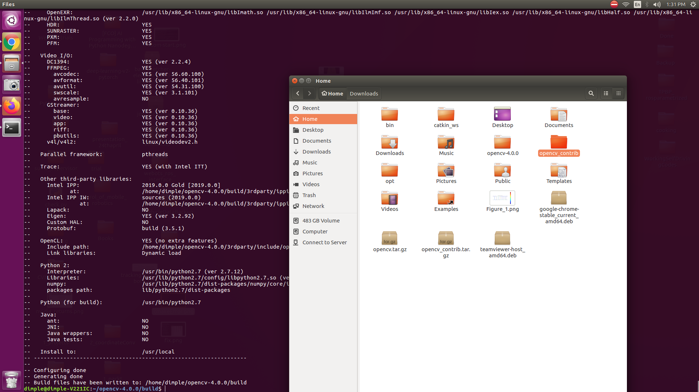

### Install dependancies  
`sudo apt-get -y install libopencv-dev build-essential cmake libdc1394-22 libdc1394-22-dev libjpeg-dev libpng12-dev libtiff5-dev libjasper-dev libavcodec-dev libavformat-dev libswscale-dev libxine2-dev libgstreamer0.10-dev libgstreamer-plugins-base0.10-dev libv4l-dev libtbb-dev libqt4-dev libmp3lame-dev libopencore-amrnb-dev libopencore-amrwb-dev libtheora-dev libvorbis-dev libxvidcore-dev x264 v4l-utils`  

### To download and build opencv4 run in terminal the following commands   
* `wget "https://github.com/opencv/opencv/archive/4.0.0.tar.gz" -O opencv.tar.gz`  
* `wget "https://github.com/opencv/opencv_contrib/archive/4.0.0.tar.gz" -O opencv_contrib.tar.gz `  
* `tar -zxvf opencv.tar.gz `  
* `tar -zxvf opencv_contrib.tar.gz`  
* `cd opencv-4.0.0`  
* `mkdir build `  
* `cd build `  
* `cmake -D CMAKE_BUILD_TYPE=Release -D CMAKE_INSTALL_PREFIX=/usr/local/opencv4 -D OPENCV_EXTRA_MODULES_PATH=/path_to(where your contrib modules are located)/opencv_contrib/modules .. `  

See the **Notes** below for errors at this step  
* `make -j4 ` 
* `sudo make install` 

#### Notes
* **Note1**  
`/path_to(where your contrib modules are located)` 
For example:  
My path is `/home/dimple/opencv_contrib/modules` 
So I will run the following in terminal  
 `cmake -D CMAKE_BUILD_TYPE=Release -D CMAKE_INSTALL_PREFIX=/usr/local/opencv4 -D OPENCV_EXTRA_MODULES_PATH=/home/dimple/opencv_contrib/modules ..` 

* **Note2**: During the build I had cmake error due to contrib path, following is the snapshot of the error  

 
I implemented a simple fix to rename the contrib folder from   
 
to   

